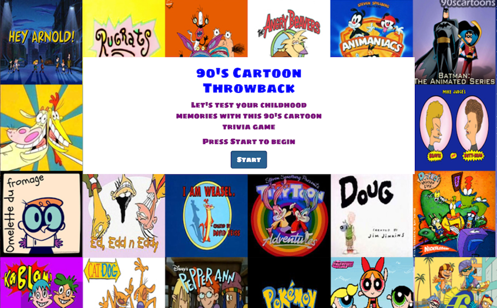
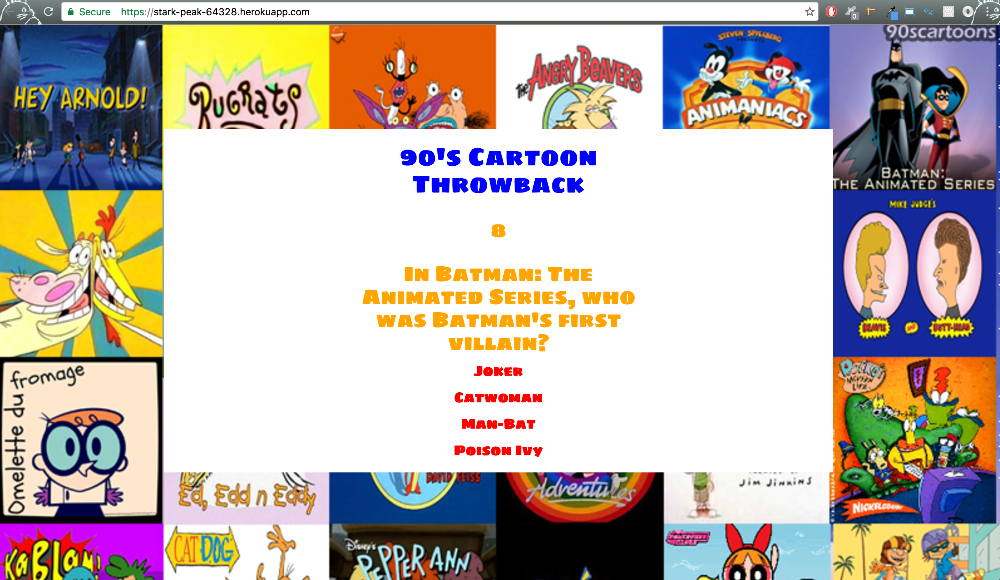

# 90’s Cartoon Trivia

[90's Cartoon Trivia link](https://stark-peak-64328.herokuapp.com/
)

### Growing up in the 90’s, there was an abundance of amazing cartoons on tv. Everything from Animaniacs to Batman: The Animated Series, the choices seemed endless and the memories have stood the test of time. Test your knowledge of these iconic cartoons with this trivia game. You will have 10 seconds to answer each question. Good luck! 

## Instructions
Only one question will be shown at a time.

The time limit will apply to each question, and when the time runs out, the game will show a screen with the correct answer, and then move on to the next question without user input.

If the user chooses the correct answer, the game will show a screen letting them know the answer was correct, and then move on to the next question without user input.

If the user chooses the incorrect answer, the game will show a screen with the correct answer, and then move on to the next question without user input.

On the final screen, show the number of correct answers, incorrect answers, and an option to restart the game (without reloading the page).

## Technologies
* [HTML](https://developer.mozilla.org/en-US/docs/Web/HTML) - hypertext markup language
* [CSS](https://developer.mozilla.org/en-US/docs/Web/CSS) - cascading style sheets
* [Bootstrap](http://getbootstrap.com/) - front-end framework
* [Javascript](https://developer.mozilla.org/en-US/docs/Web/JavaScript) - lightweight, interpreted, programming language with first-class functions
* [jQuery](https://jquery.com/) - fast, small, and feature-rich JavaScript library

## Installation
Download the zip or fork the repository and simply open the index.html on your browser.

## Screenshot

### Below is an image of the 90's Trivia Game.

### Here is an example of a question with the timer ticking down.
